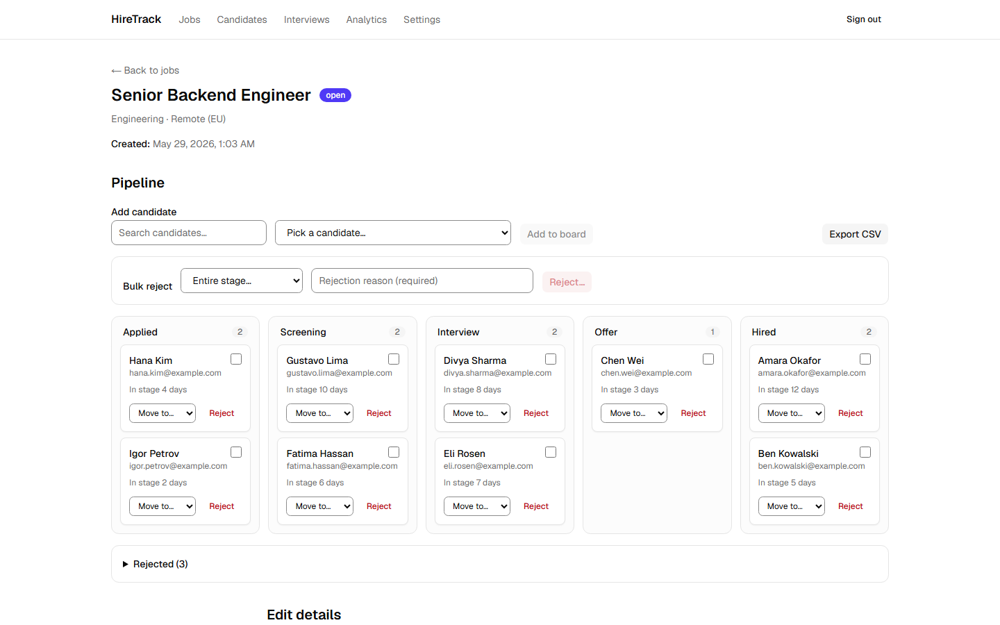
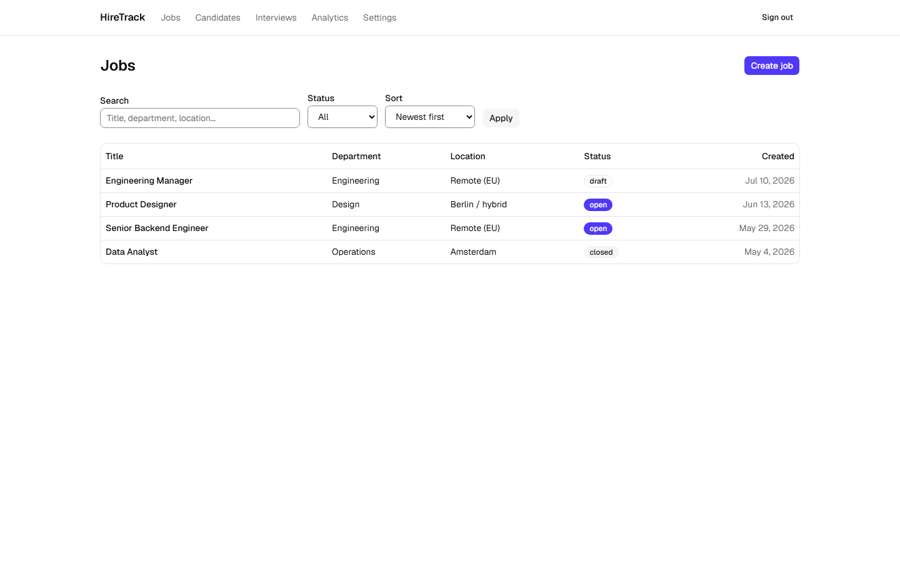
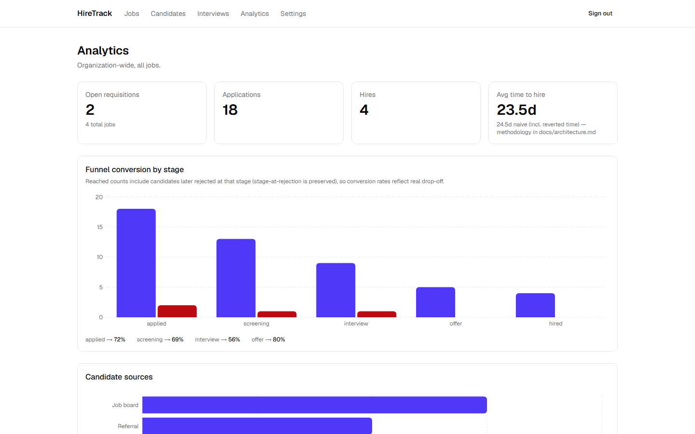
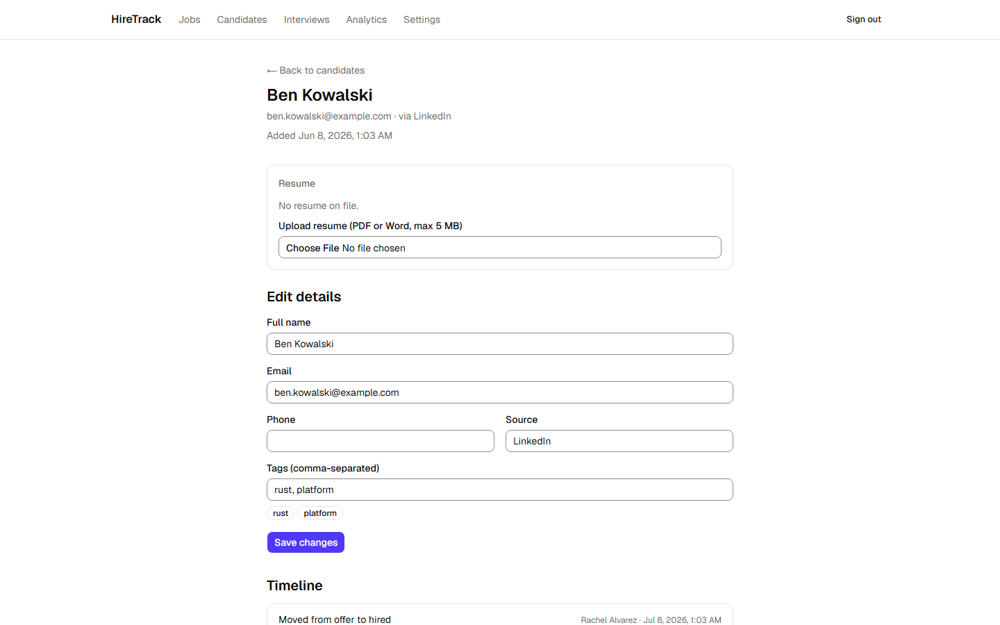
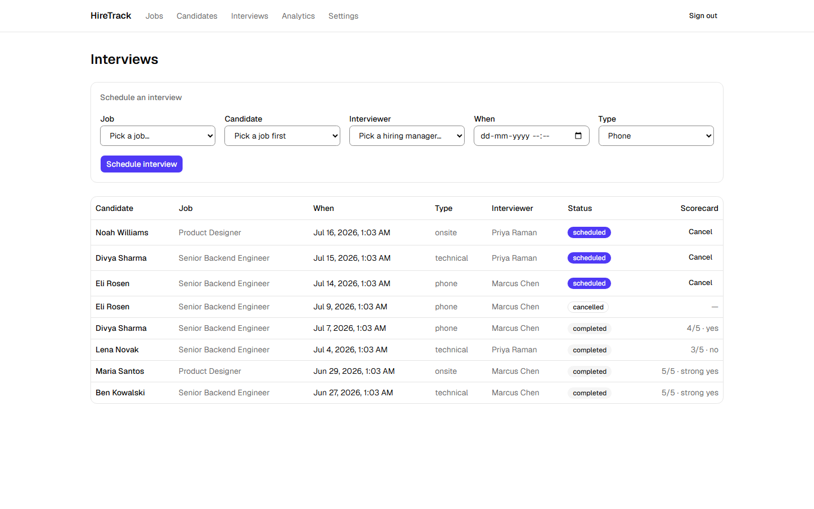
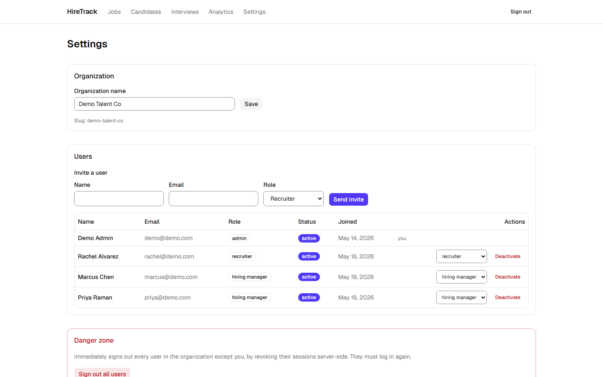

# HireTrack

> HireTrack lets a small hiring team post jobs, move candidates through a visual pipeline, run structured interview scorecards, and see where every req is stuck — without the bloat of an enterprise ATS.

[](https://github.com/arpit2705/HireTrack/actions/workflows/ci.yml)
[](LICENSE)



**Live demo → [hire-track-black.vercel.app](https://hire-track-black.vercel.app)** — log in as `demo@demo.com` / `demo1234`

## Features

- **Post and manage job requisitions** — draft → open → closed lifecycle, with search, status filters, and cursor pagination
- **Drag candidates across a Kanban pipeline** (applied → screening → interview → offer → hired) with optimistic updates that snap back on failure, plus a fully keyboard-operable "Move to…" menu on every card
- **Reject with a required reason — and reinstate** — rejection preserves the stage it happened from, and the audit trail keeps both entries
- **Bulk-reject** a selection or an entire stage server-side (select-all-across-pages), gated behind a confirm step, logged one audit row per candidate
- **Upload resumes safely** — file type decided by magic bytes (PDF/DOC/DOCX allow-list, spoofed Content-Type ignored), 5 MB enforced server-side, served only through an org-scoped, role-checked endpoint
- **Schedule interviews and collect structured scorecards** — one final scorecard per interview, submittable only by the assigned hiring manager (admins deliberately cannot)
- **Track hiring analytics** — funnel conversion that counts rejections against the stage they died at, and time-to-hire that excludes reverted-stage time ([methodology](docs/architecture.md#time-to-hire-methodology-milestone-8))
- **Export any pipeline to CSV** — streamed in cursor batches, survives 10k+ rows past gateway timeouts, formula-injection-safe
- **Audit everything** — per-candidate activity timeline across applications and interviews, with bulk actions visibly distinct from one-off ones
- **Administer the org** — invite users (set-password email doubles as verification), change roles and deactivate users with immediate session revocation, org-wide sign-out

## Tech stack

Next.js 16 (App Router) · TypeScript strict · Tailwind CSS 4 + shadcn/ui · PostgreSQL (Neon) · Prisma 7 · Auth.js (database sessions) · Zod 4 · TanStack Query · dnd-kit · Recharts · Vitest · Playwright · GitHub Actions · Vercel

## Quick start

```bash
git clone <this-repo> hiretrack && cd hiretrack
npm ci
cp .env.example .env
# fill in DATABASE_URL (any Postgres; Neon free tier works) and AUTH_SECRET
npx prisma migrate deploy   # apply schema
npx prisma generate
npm run seed                # demo org + logins + realistic pipeline data
npm run dev                 # http://localhost:3000
```

Log in with a demo account (all passwords `demo1234`) — you land directly on a populated pipeline:

| Account | Role | Sees |
|---|---|---|
| `demo@demo.com` | Admin | Everything: org-wide analytics, settings, user management |
| `rachel@demo.com` | Recruiter | Jobs, candidates, boards, scheduling, analytics for her jobs |
| `marcus@demo.com` | Hiring manager | His assigned interviews + those candidates only, scorecard forms |
| `priya@demo.com` | Hiring manager | Her assigned interviews + those candidates only |

Switching between them is the fastest way to see the role matrix enforced (a hiring manager gets an explicit 403 on candidates outside their interviews, not an empty page).

## Environment variables

| Variable | Required | Purpose |
|---|---|---|
| `DATABASE_URL` | ✅ | Postgres connection string (Neon: pooled string) |
| `AUTH_SECRET` | ✅ | Auth.js session/CSRF secret — `node -e "console.log(require('crypto').randomBytes(32).toString('base64'))"` |
| `AUTH_TRUST_HOST` | ✅ (non-Vercel) | Tells Auth.js to trust the Host header |
| `APP_URL` | ✅ | Absolute base URL — emailed links, sitemap, OG metadata derive from it |
| `RESEND_API_KEY` | optional | Real email sending; without it, verification/reset links print to the server console |
| `EMAIL_FROM` | optional | From address for outgoing mail |
| `GOOGLE_CLIENT_ID` / `GOOGLE_CLIENT_SECRET` | optional | Google sign-in button appears only when both are set |
| `BLOB_READ_WRITE_TOKEN` | optional | Vercel Blob for resumes; without it, files go to a local `.uploads/` directory |

## Architecture

The full write-up lives in **[docs/architecture.md](docs/architecture.md)**: the data model and rejection-model design, the two-layer RBAC (route rules in an edge proxy + row-level checks in handlers, with a probe-backed enforcement ledger), database sessions with real rotation/revocation, the time-to-hire methodology with a worked example, resume storage that never exposes a file URL, and the measured CSP verdict.

## Testing

```bash
npm run test        # Vitest unit suite (schemas, RBAC matrix, rate limiter, stage machine, TTH…)
npm run test:e2e    # Playwright: full pipeline e2e (incl. revert + reject/unreject) + a11y sweep + keyboard-only board probe
npm run lint && npm run typecheck
```

The e2e suites boot the dev server themselves and need `DATABASE_URL`; they create and clean their own isolated orgs.

## Screenshots

| | |
|---|---|
|  |  |
|  |  |
|  |  |

## Case Study

### Problem

Recruitment is often managed using spreadsheets, emails, and multiple communication tools, making it difficult for hiring teams to track candidates, collaborate effectively, and monitor hiring progress. As the number of applicants grows, managing the recruitment pipeline becomes increasingly inefficient.

HireTrack was built to provide a centralized Applicant Tracking System that simplifies the hiring process by enabling recruiters and hiring managers to manage jobs, applications, and candidate progress through a single, intuitive platform.

### Objective

The goal was to build a production-ready full-stack web application that demonstrates modern software engineering practices while solving a real-world recruitment problem — providing a clean user experience, secure authentication, efficient data management, and a scalable architecture suitable for small and medium-sized hiring teams.

### Approach

I followed a full-stack development approach: designing the database schema first, then building layer by layer — authentication and backend APIs before the UI. Each layer was validated with types (TypeScript strict mode), schema contracts (Zod), and automated tests before moving on.

**Stack:** Next.js 16 (App Router) · TypeScript · Tailwind CSS 4 · shadcn/ui · PostgreSQL (Neon) · Prisma · Auth.js · Zod · TanStack Query · dnd-kit · Recharts · Playwright · GitHub Actions · Vercel

### Technical Challenges

**Designing the recruitment workflow** — The primary challenge was representing hiring stages in a way that stays simple for recruiters while correctly modelling edge cases like stage reversion, rejection from any stage, and reinstatement. The rejection model preserves the stage a candidate was rejected from so funnel analytics remain accurate even after reinstatement.

**Search and filtering at scale** — Cursor-based pagination was chosen over offset pagination so that filtering and "next page" remain O(index) rather than O(table-scan) as the candidate pool grows.

**Analytics accuracy** — Time-to-hire excludes reverted-stage time (a candidate sent back from Interview to Screening should not inflate TTH). The funnel counts rejections against the stage they occurred at, not the stage the candidate is currently in.

**Authentication and role-based access** — RBAC is enforced at two independent layers: coarse-grained route rules in the edge proxy (fast path) and fine-grained row-level checks inside each API handler (correctness path). A probe-backed enforcement ledger documents every protected route and its expected HTTP status for each role, and the Playwright suite verifies it.

**Resume security** — File type is determined by magic bytes rather than the `Content-Type` header; a spoofed DOCX named `.exe` is rejected. Files are never served from a public URL — every download goes through an org-scoped, role-checked streaming endpoint.

**Code quality** — TypeScript strict mode, Zod schema validation, Prisma type safety, Vitest unit tests, Playwright e2e tests, and GitHub Actions CI keep the project maintainable as it grows.

### Result

The final application is a fully functional Applicant Tracking System that demonstrates end-to-end full-stack engineering: frontend, backend, database design, authentication, testing, CI, and deployment.

Key outcomes:
- Complete recruitment workflow from job posting through hire
- Two-layer RBAC with Playwright-verified enforcement
- Drag-and-drop Kanban board with optimistic updates and keyboard fallback
- Accurate funnel and time-to-hire analytics
- Safe resume upload, storage, and streaming download
- Bulk operations (reject, CSV export) that survive large datasets and gateway timeouts
- End-to-end test suite covering the full pipeline, accessibility sweep, and keyboard-only navigation

### What I Learned

- Planning architecture before implementation reduces complexity later — the two-layer RBAC design was sketched out in `docs/architecture.md` before a line of code was written.
- Strong database design (especially the rejection model and audit log schema) made the backend significantly easier to build and extend.
- TypeScript strict mode and Prisma eliminate whole categories of runtime bugs before they reach production.
- Authentication and authorization must be enforced server-side — client-side guards are convenience, not security.
- Good UX extends beyond functionality: responsiveness, accessibility, keyboard navigation, loading states, optimistic updates, and error recovery all matter.
- Automated testing and CI give genuine confidence during deployment, not just a green badge.

### Roadmap

Planned future improvements:

- Resume parsing and AI-powered ranking
- Google OAuth authentication
- Email notifications (offer letters, interview reminders)
- Audit log viewer in the settings UI
- Bulk candidate operations beyond reject (tag, move stage)
- PDF export in addition to CSV
- Calendar integration for interview scheduling
- Real-time notifications via WebSockets or SSE

---

## License

[MIT](LICENSE) — see also [CONTRIBUTING.md](CONTRIBUTING.md) and the [CHANGELOG](CHANGELOG.md).

---

Built as a submission for the **Digital Heroes Full Stack Developer Trial**.
