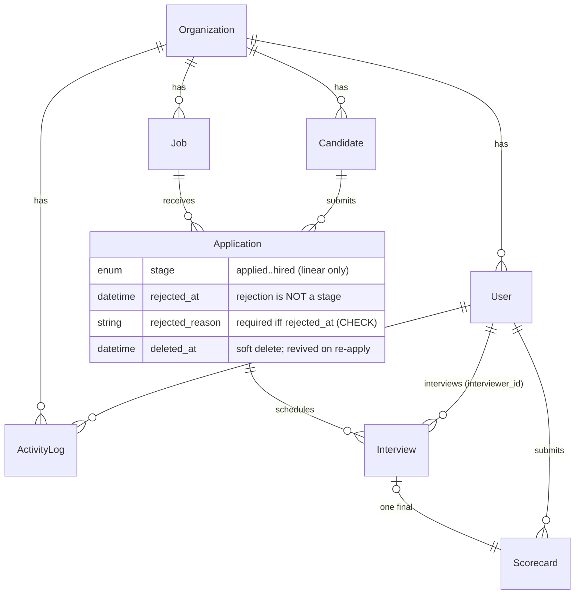

# HireTrack — Architecture

HireTrack is a multi-org applicant tracking system: Next.js 16 App Router
(REST route handlers, not server actions — deliberately, so authorization is
auditable per route), PostgreSQL on Neon via Prisma 7, Auth.js with
database sessions, Zod schemas shared verbatim between client and server.
This document explains how it's built and — because most claims here were
verified by live probes during development — what was actually proven.

## Data model

Design decisions that differ from the obvious defaults:

- **Rejection is not a stage.** The `Stage` enum is the linear pipeline
  only; an application is rejected when `rejected_at` is set, preserving the
  stage it was rejected from (which feeds funnel analytics). A symmetric
  CHECK constraint ties `rejected_at` and `rejected_reason` together.
- **One application per candidate per job** (unique index); re-applying
  after a soft delete revives the same row, clearing deletion AND rejection
  state (probed: same id returns, fields cleared).
- **Every mutating action writes one `activity_log` row** with actor,
  entity, action, and metadata — bulk operations write one row PER entity
  under a shared `batchId` (probed: 3 targets → 3 rows, 1 batch).
- Notable indexes: `(job_id, rejected_at)` drives the Kanban query,
  `(org_id, email)` dedupes candidates, trigram GIN indexes serve search,
  `(org_id, entity_type, entity_id)` serves per-entity audit timelines.
- Auth infrastructure (sessions, OAuth accounts, single-use hashed email
  tokens, a Postgres-backed rate-limit table) lives beside the domain model.

## Authentication & sessions

**In one paragraph:** users sign in with email/password (Argon2id-hashed,
never logged) or Google; every login creates a row in the `session` table
and the browser holds only an opaque httpOnly/SameSite=Lax cookie, so a
session can be rotated or revoked server-side and the very next request
with an old cookie is a 401 — rotation happens automatically on login and
on every privilege change (email verification rotates; password reset,
role change, and deactivation revoke everything), login and reset are
rate-limited per IP+account with exponential lockout, and unverified
accounts can read but cannot write until they click the emailed
verification link.

Details worth knowing:

- Auth.js is configured with the **database session strategy**; credentials
  logins create the session row through a `jwt.encode` override (Auth.js
  only auto-creates rows for OAuth). Google can only sign in EXISTING users
  — accounts come from signup (org owner) or invites, never implicitly.
- Invites reuse the reset-token flow: the emailed set-password link both
  sets credentials and verifies the address.
- Revocation was verified behaviorally, not by flag-flipping: replaying a
  revoked cookie against protected routes returns 401 (API) / 307 (pages) —
  probed after password reset, after role change, after deactivation, and
  after the org-wide sign-out danger action.
- The session cookie's `__Secure-` prefix follows the actual request
  protocol, not `NODE_ENV` (readers accept both names) — a local production
  server over http broke otherwise.

## Authorization — two layers

1. **Route-level** (`src/lib/auth/access.ts`, executed in `src/proxy.ts` on
   every request): the plan's role permission matrix as data
   (`PERMISSIONS`), applied through find-first `ROUTE_RULES`. Identity comes
   from the database session — never from anything the client sent; the
   proxy strips inbound `x-user-*` headers before stamping its own.
   **Unregistered `/api` paths are denied by default**, so a new route
   cannot ship unenforced. Email verification gates all write methods here.
2. **Row-level** (route handlers): org scoping and ownership. Handler
   identity comes only from `requireUser()`; query modules take `orgId` as
   their first argument and bake it into every WHERE, so the org boundary
   cannot be forgotten. Input schemas are `z.strictObject` — a payload
   smuggling `orgId` is a 400, never silently ignored. Convention:
   **cross-org ids return 404** (no existence leak); same-org role/row
   denials return explicit 403s (a hiring manager outside their interviews
   gets `403 not_assigned`, never an empty list).

Hiring managers are the interesting case: their access is defined ENTIRELY
by `interview.interviewer_id`. They pass the proxy for single-candidate
reads (`candidate:view_one`) and the handler requires an assigned interview.
Scorecards go further: only the assigned interviewer may submit (admins
deliberately cannot — the matrix's explicit negative, probed live), one
scorecard per interview, final.

Admin user management has a **transactional last-admin guard**: demoting or
deactivating an active admin takes a per-org `pg_advisory_xact_lock` and
re-counts inside the same transaction. Probed with the actual race — two
concurrent cross-demotions of exactly two admins — exactly one succeeded,
the loser got `400 cannot_remove_last_admin`.

### Page-level enforcement ledger (all rows CLOSED)

Every app screen carries a route rule plus a **denial probe** (unit test on
`decideAccess` and/or a live smoke probe). Closed during development, kept
here as the record:

| Surface | Allowed | Probes |
|---|---|---|
| `/jobs*` | admin, recruiter | HM page → 307 away, HM API → 403; cross-org job read/mutate → 404; forged `orgId` → 400 |
| `/candidates*` | admin, recruiter; HM conditionally on `/candidates/[id]` | unassigned same-org HM → explicit 403 on API, resume, and page; assigned HM → 200 |
| Resume file access | org-scoped per request | Org-2 session → 404; exact storage key over HTTP → 404; zero locators in any response (grepped); EXE/HTML-as-.pdf → 415; 6 MB → 413 |
| `/interviews*` | all roles (HM sees own only); scheduling recruiter+ | HM list = own only; cross-org schedule/cancel/score → 404 |
| `/interviews/[id]/scorecard` | assigned HM only | admin → 403 at proxy; other HM → 403 `not_your_interview`; duplicate → 409 |
| `/analytics` | admin (org), recruiter (own jobs) | HM → 403/307; other recruiter's `jobId` → 404; numbers verified against seeded worked example |
| `/settings`, `/api/org*`, `/api/users*` | admin | recruiter/HM denied; revocation replays 401; self-modification 400; last-admin race |
| Public: `/`, auth pages, `/opengraph-image` | anonymous | OG image was caught behind the proxy by the unfurl probe (307 for scrapers) and made public |

## Pipeline semantics

- Forward moves may jump stages; backward moves are exactly one stage.
  Forward logs `stage_updated`, backward logs `stage_reverted` — a hard
  analytics contract (see time-to-hire below). Multi-stage backward or
  no-op moves are 409.
- Rejection has its own endpoint with a required reason (400 without, both
  client- and server-side), preserves the stage, and blocks further moves;
  **unreject** clears rejection state and the candidate reappears at the
  stage rejected from, with a distinct `unrejected` audit entry.
- **Concurrent moves are last-write-wins with a full audit trail** (probed
  live with two users racing): both writers get 200 with their own
  post-write state, both land in the log with distinct actors, and every
  client refetches the authoritative board after settling (TanStack
  `onSettled` → invalidate) — that refetch is what reconciles the loser's
  optimistic card. Board mutations use `fetch keepalive` so a navigation
  right after a drop can't abort the request (probed: move committed
  despite immediate unload).

## Bulk actions & CSV export

Bulk reject targets either explicit ids (checkbox selection) or a
server-side filter `{jobId, stage?}` — the filter path is
select-all-across-pages and sweeps the whole set regardless of what was
rendered (probed: 12/12 in one call). Reason required identically to single
reject; the UI gates both behind an explicit confirm step.

The CSV export **streams**: an async generator pulls cursor batches of 500
through a `ReadableStream`, so memory is bounded and long exports survive
gateway timeouts — probed with 10,015 rows: `Transfer-Encoding: chunked`,
first byte at 1.9s, total 44s (past the ~30s threshold) with every row
delivered. Fields are RFC-4180-escaped and formula-injection-neutralized
(leading `= + - @` cells get an apostrophe).

## Resume storage

**No client-visible file URLs exist.** Files live behind a driver
(`src/lib/storage.ts`: Vercel Blob when `BLOB_READ_WRITE_TOKEN` is set,
local `.uploads/` in dev); the driver's locator is a server-side secret
stored in the DB and stripped by the serializer. The ONLY path to bytes is
`GET /api/candidates/:id/resume`, which re-checks session, role, and org on
every request and streams with `Cache-Control: private, no-store` +
`Content-Disposition: attachment`. Upload validation trusts magic bytes
only (PDF/DOC/DOCX; the declared Content-Type is deliberately ignored) with
a 5 MB server-side cap on actual bytes. Residual risk, accepted and
documented: a leaked locator (DB dump, log bug) would be fetchable on
Vercel Blob until deleted; mitigation is never emitting it.

## Analytics

### Time-to-hire methodology

**`time-to-hire = (hired_at − applied_at) − underwater time`**, where
"underwater" is any interval during which the application's current stage
sits BELOW the highest stage it had already reached. The clock runs at the
frontier (including time re-spent in a regained stage) and stops from a
revert until the application climbs back to its previous maximum — re-doing
already-done work is what "reverted time" means. Inputs are the activity
trail only; `stage_updated_at` keeps meaning "when the current stage was
entered" and is untouched.

Worked example — applied → screening → offer → interview (reverted) →
offer → hired at days 0/2/5/7/10/12: naive = 12d; underwater = day 7→10
(current `interview` < max `offer`) = 3d; **TTH = 9 days**. If the
application instead jumps interview → hired at day 10, underwater is still
3d and TTH = **7 days** — a last-minute revert-then-hire can't distort the
metric. Unit tests reproduce these tables verbatim (doc wins on conflict),
and a live probe seeded this exact timeline and read back 9.0/12.0 from the
API. Stated non-goal: rejected→unrejected waiting time is NOT excluded, and
the dashboard shows the naive average alongside so the exclusion is
visible.

### Funnel & scope

Funnel "reached stage S" counts applications whose current stage index ≥ S
— correct for rejected candidates precisely because rejection preserves the
stage, so a rejected-from-interview candidate counts against interview's
conversion instead of vanishing (probed: 50% conversion with one rejection
at interview). Scope follows the matrix: admins org-wide, recruiters their
created jobs (another recruiter's `jobId` → 404).

## Quality gates

- **Tests**: Vitest unit suite (RBAC matrix incl. negatives, rate limiter,
  stage machine, TTH worked examples, CSV escaping, schema smuggling
  rejections); one Playwright e2e covering the full pipeline INCLUDING a
  stage revert and a reject→unreject cycle, asserting final board, audit
  timeline, and analytics state; an axe sweep of every screen plus a
  keyboard-only Kanban move (Tab to the card's "Move to…" menu, ArrowDown,
  asserted in the DB).
- **Lighthouse (production build, real runs)**: landing 94/100/96/100,
  login 90/100/96/100 (perf/a11y/BP/SEO). The Best-Practices 96 is a
  measurement artifact: with no CSP header at all, BP = 100 — Lighthouse's
  own injected scripts trip a DevTools CSP issue under any restrictive
  `script-src`; real users see a clean console.
- **CSP verdict (measured)**: two nonce variants were built and scored —
  nonce+`strict-dynamic` breaks Turbopack's un-nonced chunk preloads
  (BP 96→92); `'self'`+nonce breaks Next's Suspense streaming inline
  scripts (blocked + console errors). `'unsafe-inline'` therefore stays,
  with per-request nonce plumbing retained in `proxy.ts` so re-enabling is
  a one-line change when Next nonces its streaming scripts. Other headers:
  HSTS, nosniff, frame-ancestors 'none' (X-Frame-Options dropped as
  redundant), referrer and permissions policies, CSRF origin checks on all
  writes.
- **Contrast is verified against rendered tokens**, not intended values —
  three real failures were found and fixed (muted-foreground on chips
  4.34→4.74:1; input borders 1.26→3.36:1; destructive soft buttons
  4.44→5.56:1, which required reducing chroma because the original oklch
  value was outside the sRGB gamut and Chrome's gamut mapping swallowed
  lightness tweaks).

## Demo seed

`npm run seed` (or `prisma db seed`) rebuilds the `demo-talent-co` org
wholesale — idempotent by reconstruction (three consecutive runs verified
identical: 18 applications, 8 interviews, 4 scorecards, 70 audit rows).
Login `demo@demo.com` / `demo1234`; authenticated users hitting `/` land
directly in the product (`/jobs`; hiring managers → `/interviews`). The
data covers every product state, and the backdated trails make analytics
non-trivial: 4 hires averaging 23.5d excluding reverted vs 24.5d naive.

## Deploy gate (v1.0.0 checklist — needs the LIVE URL)

1. Google Rich Results Test on the live landing page (JSON-LD).
2. Paste the live URL into a real unfurler (Slack / opengraph.xyz) and
   confirm the OG card renders.
3. Re-run Lighthouse on the live URL (all ≥90, SEO 100).
4. `APP_URL` set to the production domain; `AUTH_SECRET`, `DATABASE_URL`,
   `BLOB_READ_WRITE_TOKEN`, `RESEND_API_KEY` configured.
5. Replace `OWNER/REPO` placeholders in README badges and CHANGELOG links;
   add the live demo link to the README.
6. Verify in incognito: demo login, zero console errors, no leaked secrets
   in the client bundle (grep for `AUTH_SECRET`, `DATABASE_URL`, locators).
